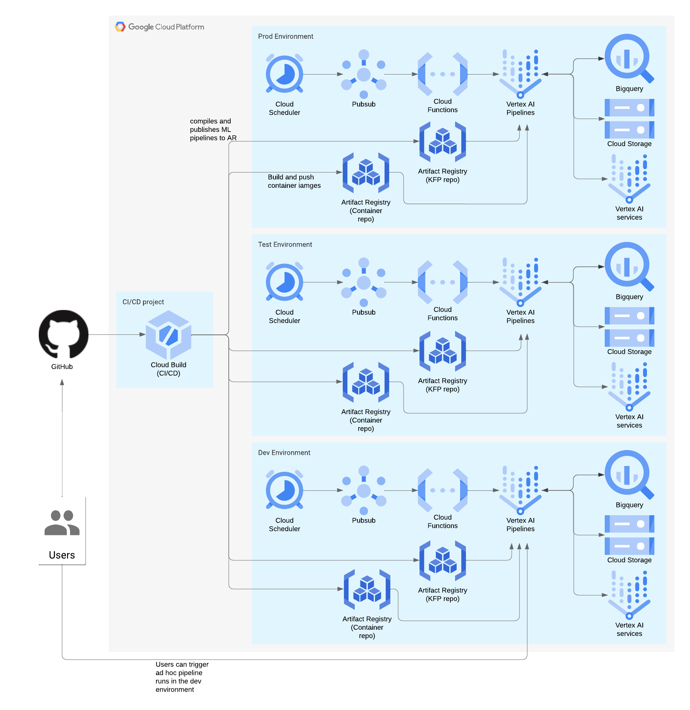

<!-- 
Copyright 2023 Google LLC

Licensed under the Apache License, Version 2.0 (the "License");
you may not use this file except in compliance with the License.
You may obtain a copy of the License at

    https://www.apache.org/licenses/LICENSE-2.0

Unless required by applicable law or agreed to in writing, software
distributed under the License is distributed on an "AS IS" BASIS,
WITHOUT WARRANTIES OR CONDITIONS OF ANY KIND, either express or implied.
See the License for the specific language governing permissions and
limitations under the License.
 -->

# Vertex Pipelines End-to-End Samples

_AKA "Vertex AI Turbo Templates"_


## Introduction

This repository provides a reference implementation of [Vertex Pipelines](https://cloud.google.com/vertex-ai/docs/pipelines/) for creating a production-ready MLOps solution on Google Cloud.
You can take this repository as a starting point you own ML use cases. 
The implementation includes:

* **Infrastructure-as-Code** using Terraform for a typical dev/test/prod setup of Vertex AI and other relevant services
* **ML training and prediction pipelines** using the Kubeflow Pipelines
* **Reusable Kubeflow components** that can be used in common ML pipelines
* **CI/CD** using Google Cloud Build for linting, testing, and deploying ML pipelines
* **Developer scripts** (Makefile, Python scripts etc.)

**Get started today by following [this step-by-step notebook tutorial](./docs/notebooks)! 🚀**
In this three-part notebook series you'll deploy a Google Cloud project and run production-ready ML pipelines using Vertex AI without writing a single line of code.

## Cloud Architecture

The diagram below shows the cloud architecture for this repository.



There are four different Google Cloud projects in use

* `dev` - a shared sandbox environment for use during development
* `test` - environment for testing new changes before they are promoted to production. This environment should be treated as much as possible like a production environment.
* `prod` - production environment
* `admin` - separate Google Cloud project for setting up CI/CD in Cloud Build (since the CI/CD pipelines operate across the different environments)

Vertex Pipelines are scheduled using Google Cloud Scheduler. 
Cloud Scheduler emits a Pub/Sub message that triggers a Cloud Function, which in turn triggers the Vertex Pipeline to run. 
_In future, this will be replaced with the Vertex Pipelines Scheduler (once there is a Terraform resource for it)._

## Setup

**Prerequisites:**

- [Terraform](https://www.terraform.io/) for managing cloud infrastructure
- [tfswitch](https://tfswitch.warrensbox.com/) to automatically choose and download an appropriate Terraform version (recommended) 
- [Pyenv](https://github.com/pyenv/pyenv#installation) for managing Python versions
- [Poetry](https://python-poetry.org/) for managing Python dependencies
- [Google Cloud SDK (gcloud)](https://cloud.google.com/sdk/docs/quickstart)
- Make
- Cloned repo

**Deploy infrastructure:**

You will need four Google Cloud projects dev, test, prod, and admin.
The Cloud Build pipelines will run in the _admin_ project, and deploy resources into the dev/test/prod projects.
Before your CI/CD pipelines can deploy the infrastructure, you will need to set up a Terraform state bucket for each environment:

```bash
export DEV_PROJECT_ID=my-dev-gcp-project
export DEV_LOCATION=europe-west2
gsutil mb -l $DEV_LOCATION -p $DEV_PROJECT_ID --pap=enforced gs://$DEV_PROJECT_ID-tfstate && \
  gsutil ubla set on gs://$DEV_PROJECT_ID-tfstate
```

Enable APIs in admin project:

```bash
export ADMIN_PROJECT_ID=my-admin-gcp-project
gcloud services enable cloudresourcemanager.googleapis.com serviceusage.googleapis.com --project=$ADMIN_PROJECT_ID
```

```bash
make deploy env=dev
```

More details about infrastructure is explained in [this guide](docs/Infrastructure.md).
It describes the scheduling of pipelines and how to tear down infrastructure.

**Install dependencies:**

```bash
pyenv install -skip-existing                          # install Python
poetry config virtualenvs.prefer-active-python true   # configure Poetry
make install                                          # install Python dependencies
cd pipelines && poetry run pre-commit install         # install pre-commit hooks
cp env.sh.example env.sh
```

Update the environment variables for your dev environment in `env.sh`.

**Authenticate to Google Cloud:**

```bash
gcloud auth login
gcloud auth application-default login
```

## Run

This repository contains example ML training and prediction pipelines which are explained in [this guide](docs/Pipelines.md).

**Build containers:** The [model/](/model/) directory contains the code for custom training and prediction container images, including the model training script at [model/training/train.py](model/training/train.py). 
You can modify this to suit your own use case.
Build the training and prediction container images and push them to Artifact Registry with:

```bash
make build [ images="training prediction" ]
```

Optionally specify the `images` variable to only build one of the images.

**Execute pipelines:** Vertex AI Pipelines uses KubeFlow to orchestrate your training steps, as such you'll need to:

1. Compile the pipeline
1. Build dependent Docker containers
1. Run the pipeline in Vertex AI

Execute the following command to run through steps 1-3:

```bash
make run pipeline=training [ build=<true|false> ] [ compile=<true|false> ] [ cache=<true|false> ] [ wait=<true|false> ] 
```

The command has the following true/false flags:

- `build` - re-build containers for training & prediction code (limit by setting images=training to build only one of the containers)
- `compile` - re-compile the pipeline to YAML
- `cache` - cache pipeline steps
- `wait` - run the pipeline (a-)sync

**Shortcuts:** Use these commands which support the same options as `run` to run the training or prediction pipeline:

```bash
make training
make prediction
```

## Test

Unit tests are performed using [pytest](https://docs.pytest.org).
The unit tests are run on each pull request. 
To run them locally you can execute the following command and optionally enable or disable testing of components:

```
make test [ packages=<pipelines components> ]
```

## Automation

For details on setting up CI/CD, see [this guide](./docs/Automation.md).

## Putting it all together

For a full walkthrough of the journey from changing the ML pipeline code to having it scheduled and running in production, please see the guide [here](./docs/Production.md).

We value your contribution, see [this guide](./docs/Contribution.md) for contributing to this project.
