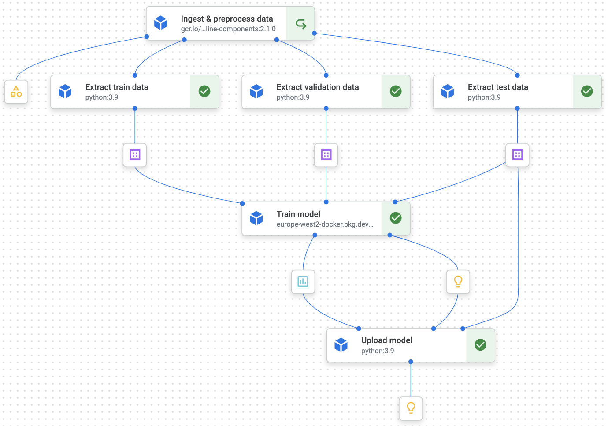
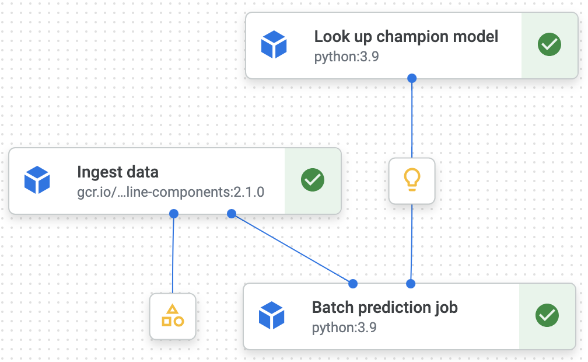

<!-- 
Copyright 2023 Google LLC

Licensed under the Apache License, Version 2.0 (the "License");
you may not use this file except in compliance with the License.
You may obtain a copy of the License at

    https://www.apache.org/licenses/LICENSE-2.0

Unless required by applicable law or agreed to in writing, software
distributed under the License is distributed on an "AS IS" BASIS,
WITHOUT WARRANTIES OR CONDITIONS OF ANY KIND, either express or implied.
See the License for the specific language governing permissions and
limitations under the License.
 -->
# ML Pipelines

There are two ML pipelines defined in this repository: 
- training pipeline (located in `pipelines/src/pipelines/training.py`
- batch prediction pipeline (located in `pipelines/src/pipelines/prediction.py`)

## Pipeline input parameters

The ML pipelines have input parameters. 
As you can see in the pipeline definition files (`pipelines/src/pipelines/<training|prediction>/pipeline.py`), they have default values, and some of these default values are derived from environment variables (which in turn are defined in `env.sh`).

When triggering ad hoc runs in your dev (or sandbox) environment, or when running the E2E tests in CI, these default values are used. 
For the test and production deployments, the pipeline parameters are defined in the Terraform code for the Cloud Scheduler jobs (`terraform/envs/<dev|test|prod>/scheduled_jobs.auto.tfvars`) - see the section on [Scheduling pipelines](#scheduling-pipelines).

## Customize pipelines

### Adding a new pipeline

This repository contains a training and a (batch) prediction pipeline. To add another ML pipeline (e.g. for continuous evaluation), create a new directory under the `pipelines/src/pipelines` directory. Within your new pipeline folder, create a `pipeline.py` file - this is where you should provide your pipeline definition using the KFP DSL (in a function named `pipeline`).

Alternatively, you can just copy and paste the `training` or `prediction` directory.

See below for an example folder structure:

```
vertex-pipelines-end-to-end-samples
|
├── pipelines
│   ├── src
│   │   ├── pipelines
│   │   │   ├── new_pipeline
│   │   │   │   ├── pipeline.py
│   │   │   │   └── queries
│   │   │   │       └── my_query.sql
```

Make sure that you give the ML pipeline a unique name in the `@pipeline` decorator.

To run your pipeline, use `make run` as before (optionally adding parameter to wait until pipeline is finished before returning - defaults to false):

```bash
make run pipeline=your_new_pipeline
```

Some of the scripts e.g. CI/CD pipelines assume only a training and prediction pipeline. You will need to adapt these to add in the compile, run and upload steps for your new pipeline in [cloudbuild/pr-checks.yaml](/cloudbuild/pr-checks.yaml), [cloudbuild/e2e-test.yaml](/cloudbuild/e2e-test.yaml) and [cloudbuild/release.yaml](/cloudbuild/release.yaml).

## Training pipeline

A screenshot of the completed ML pipeline is shown below.



In the next sections we will walk through the different pipeline steps.

### Ingestion / preprocessing step

The first pipeline step runs a SQL script in BigQuery to extract data from the source table and load it into tables according to a train/test/validation split.

The SQL query for this can be found in `pipelines/src/pipelines/queries/preprocessing.sql`.

As you can see in this SQL query, there are some placeholder values (marked by the curly brace syntax `{{ }}`). When the pipeline runs, these are replaced with values provided from the ML pipeline.

In the pipeline definition, the `generate_query` function is run at pipeline compile time to generate a SQL query (as a string) from the template file (`preprocessing.sql`). The placeholders (`{{ }}` values) are replaced with KFP placeholders that represent pipeline parameters, or values passed from other pipeline components at runtime. In turn, these placeholders are automatically replaced with the actual values at runtime by Vertex Pipelines.

The `preprocessing` step in the pipeline uses this string (`preprocessing_query`) in the `BigqueryQueryJobOp` component (provided by [Google Cloud Pipeline Components](https://cloud.google.com/vertex-ai/docs/pipelines/components-introduction))

### Extraction steps

Once the data has been split into three tables (for train/test/validation split), each table is downloaded to Google Cloud Storage as a CSV file. This is done so that there is a copy of the train/test/validation data for each pipeline run that you have a record of.

(Alternatively, you could choose to omit this step, leave the data in BigQuery and consume the data directly from BigQuery for your training step).

This step is performed using a custom KFP component located in [components/bigquery-components/src/bigquery_components/extract_bq_to_dataset.py](/vertex_components/extract_bq_to_dataset.py).

### Training step

The training step is defined as a [KFP container component](https://www.kubeflow.org/docs/components/pipelines/v2/components/container-components/) in the [pipeline.py](/pipelines/src/pipelines/training.py) file.

The container image used for this component is built using CI/CD (or the `make build target=training` command if you want to build it during development).

The source code for this container image (and the prediction container image) can be found in the [model](/model/) directory. Dependencies are managed using Poetry. The model training script can be found at [model/training/train.py](/model/training/train.py) and can be modified to suit your use case.

The training script trains a simple XGBoost model wrapped in a scikit-learn pipeline, and saves it as `model.joblib`.


The model is evaluated and metrics are saved as a JSON file. In the Vertex pipeline, the model appears as a KFP Model artifact, and the JSON file appears as a KFP Metrics artifact.

### Upload model step

The upload model step uploads the model to the Vertex model registry. This step uses a custom KFP component that can be 
found in [components/vertex-components/src/vertex_components/upload_model.py](//vertex_components/upload_model.py). It does the following:

1. Checks if there is an existing "champion" model with the same name in the Vertex Model Registry
1. If there is, fetch its latest model evaluation and compare it with the model evaluation of the newly trained "challenger" model
1. If the new model performs better, or if there is no existing champion model, upload the newly trained "challenger" model and tag it with the `default` alias to designate it as the new champion model
1. If the new model performs worse than the existing "champion" model, upload the new model to the registry, but don't tag it with the `default` alias
1. Import the model evaluation of the newly-trained model and attach it to the newly-uploaded model in the Vertex Registry

| :bulb: Quick note on Champion-Challenger comparisons    |
|:-------------------|
| In practice, you should be aware of that and give the model a specific name related to the ML project you are working on once the new model is not comparable with the previous models. 
For example, when you want to train a new model using different features, the best practice is to change your model name in the pipeline input parameters. |

## Batch prediction pipeline

A screenshot of the completed ML pipeline is shown below.



In the next sections we will walk through the different pipeline steps.

### Ingestion / preprocessing step

The first pipeline step runs a SQL script in BigQuery to extract data from the source table and load it into a different BigQuery table, ready for predictions to generated.

The SQL query for this can be found in [pipelines/src/pipelines/prediction/queries/preprocessing.sql](/pipelines/src/pipelines/prediction/queries/preprocessing.sql).

As you can see in this SQL query, there are some placeholder values (marked by the curly brace syntax `{{ }}`). When the pipeline runs, these are replaced with values provided from the ML pipeline.

In the pipeline definition, the `generate_query` function is run at pipeline compile time to generate a SQL query (as a string) from the template file (`preprocessing.sql`). The placeholders (`{{ }}` values) are replaced with KFP placeholders that represent pipeline parameters, or values passed from other pipeline components at runtime. In turn, these placeholders are automatically replaced with the actual values at runtime by Vertex Pipelines.

The `preprocessing` step in the pipeline uses this string (`preprocessing_query`) in the `BigqueryQueryJobOp` component (provided by [Google Cloud Pipeline Components](https://cloud.google.com/vertex-ai/docs/pipelines/components-introduction))

### Look up model

This step looks up the "champion" model from the Vertex Model Registry. 
It uses a custom KFP component that can be found in [components/vertex-components/src/vertex_components/lookup_model.py](//vertex_components/lookup_model.py). It uses the Vertex AI Python SDK to list models with a given model name and retrieve the model version that uses the `default` alias, indicating that it is the "champion" model.

### Batch Prediction

This step submits a Vertex Batch Prediction job that generates predictions from the BigQuery table from the ingestion/preprocessing step. It uses a custom KFP component that can be found in [components/vertex-components/src/vertex_components/model_batch_predict.py](//vertex_components/model_batch_predict.py). It uses Vertex Model Monitoring for batch prediction to monitor the data for drift.

## Pipeline input parameters

The ML pipelines have input parameters. As you can see in the pipeline definition files (`src/pipelines/<training|prediction>/pipeline.py`), they have default values, and some of these default values are derived from environment variables (which in turn are defined in `env.sh` as described above).

When triggering ad hoc runs in your dev/sandbox environment, or when running the E2E tests in CI, these default values are used. For the test and production deployments, the pipeline parameters are defined in the Terraform code for the Cloud Scheduler jobs (`envs/<test|prod>/scheduled_jobs.auto.tfvars`).

### Cache Usage in pipeline

When Vertex AI Pipelines runs a pipeline, it checks to see whether or not an execution exists in Vertex ML Metadata with the interface (cache key) of each pipeline step (component).
If the component is exactly the same and the arguments are exactly the same as in some previous execution, then the task can be skipped and the outputs of the old step can be used. 
Since most of the ML projects take a long time and expensive computation resources, it is cost-effective to use cache when you are sure that the output of components is correct. 
In terms of [how to control cache reuse behavior](https://cloud.google.com/vertex-ai/docs/pipelines/configure-caching), in generally, you can do it for either a component or the entire pipeline (for all components). 
If you want to control caching behavior for individual components, add `.set_caching_options(<True|False>)` after each component when building a pipeline.
To change the caching behaviour of ALL components within a pipeline, you can specify this when you trigger the pipeline like so: `make run pipeline=<training|prediction>`
It is suggested to start by disabling caching of components during development, until you have a good idea of how the caching behaviour works, as it can lead to unexpected results.
