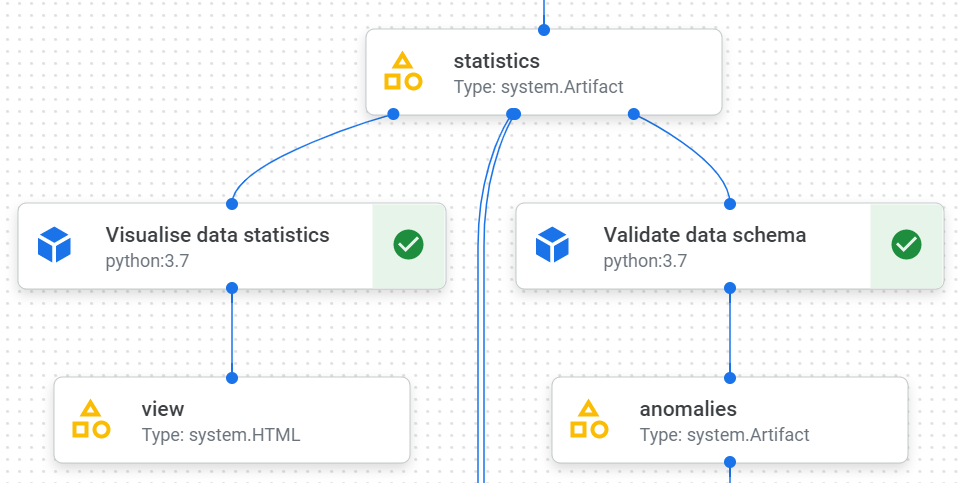
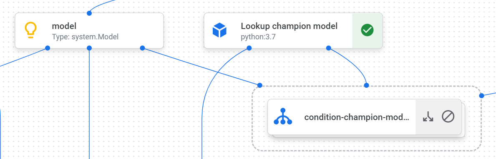
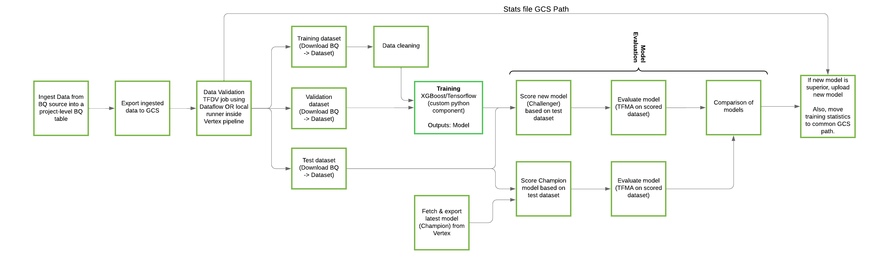
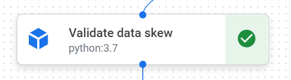
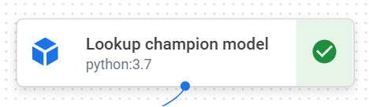
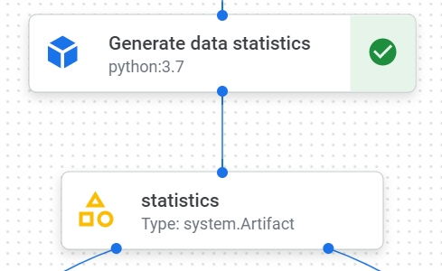
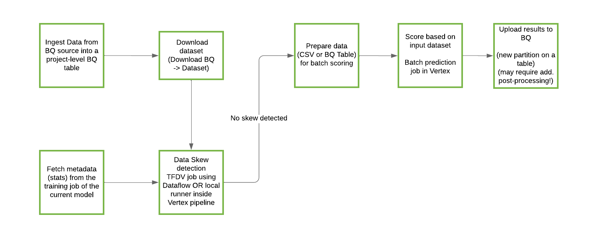

<!-- 
Copyright 2022 Google LLC

Licensed under the Apache License, Version 2.0 (the "License");
you may not use this file except in compliance with the License.
You may obtain a copy of the License at

    https://www.apache.org/licenses/LICENSE-2.0

Unless required by applicable law or agreed to in writing, software
distributed under the License is distributed on an "AS IS" BASIS,
WITHOUT WARRANTIES OR CONDITIONS OF ANY KIND, either express or implied.
See the License for the specific language governing permissions and
limitations under the License.
 -->
 # Pipelines

## Introduction

This repository provides templates and reference implementations of [Vertex AI Pipelines](https://cloud.google.com/vertex-ai/docs/pipelines/) for production-grade training and batch prediction pipelines on GCP for:
- [TensorFlow](https://www.tensorflow.org/api_docs)
- [XGBoost](https://xgboost.readthedocs.io/en/stable/) (using the [Scikit-Learn wrapper interface for XGBoost](https://xgboost.readthedocs.io/en/latest/python/python_api.html#module-xgboost.sklearn))

Further useful documentation:
- [KubeFlow Pipelines SDK](https://www.kubeflow.org/docs/components/pipelines/sdk/sdk-overview/)
- [Google Cloud Pipeline Components - Vertex Training Wrapper](https://github.com/kubeflow/pipelines/blob/master/components/google-cloud/google_cloud_pipeline_components/experimental/custom_job/utils.py)
- [Vertex AI](https://cloud.google.com/vertex-ai)

The sections below provide a general description of the ML pipelines (training and prediction) for both the TensorFlow template and XGBoost template. These two templates are similar in most ways and a complete overview of their key differences are given in their own README files:
- [TensorFlow pipelines README](tensorflow/README.md)
- [XGBoost pipelines README](xgboost/README.md)

## Training Pipeline
### Prerequisites for training pipeline
- TFDV schema

    

- Optional: an existing champion model

    

### Components in training pipeline
As an example, the overall flow diagram for the TensorFlow training pipeline is shown below:

The training pipeline can be broken down into the following sequence of components at a high level:

| Step No |           Step Name            | Description                                                                                                                                                                                                                                                                                                                                                                                                                                                                                                                                                                                                                                                                                                                                                                                                                                                                  | Input(s)                                                                                                                                                                                                                          | Output(s)                                                                              |
| :-----: | :----------------------------: | :--------------------------------------------------------------------------------------------------------------------------------------------------------------------------------------------------------------------------------------------------------------------------------------------------------------------------------------------------------------------------------------------------------------------------------------------------------------------------------------------------------------------------------------------------------------------------------------------------------------------------------------------------------------------------------------------------------------------------------------------------------------------------------------------------------------------------------------------------------------------------- | :-------------------------------------------------------------------------------------------------------------------------------------------------------------------------------------------------------------------------------- | :------------------------------------------------------------------------------------- |
|    1    |        Generate Queries        | Generate base preprocessing & train-test-validation split queries for Google BigQuery. This component only needs a `.sql` file and all parametrized values in that `.sql` file (`source_dataset`, `source_table`, `filter_column`, and so on)                                                                                                                                                                                                                                                                                                                                                                                                                                                                                                                                                                                                                                |                                                                                                                                                                                                                                   |                                                                                        |
|    2    |       BQ Query to Table        | This component takes the generated query from the previous component & runs it on Google BigQuery to create the required table (preprocessed data/ train-test-validation data).                                                                                                                                                                                                                                                                                                                                                                                                                                                                                                                                                                                                                                                                                              | Output from **Generate Queries**                                                                                                                                                                                                  | New Google BigQuery table created                                                      |
|    3    |     Extract BQ to Dataset      | Creates CSV file/s in Google Cloud Storage from the Google BigQuery tables created in the previous component                                                                                                                                                                                                                                                                                                                                                                                                                                                                                                                                                                                                                                                                                                                                                                 | BigQuery table created from **BQ Query to Table**                                                                                                                                                                                 | BigQuery table converted to Google Cloud Storage objects as CSV/JSONL files and corresponding file directory and path |
|    4    |      Generate Statistics       | Generate training statistics based on `ingested_dataset` CSV files in Google Cloud Storage (output from previous component). This component relies on TFDV and also supports running on DataFlow - see [here](kfp_components/tfdv/generate_statistics.md) for more details.                                                                                                                                                                                                                                                                                                                                                                                                                                                                                                                                                                                                                                                                                 | Google Cloud Storage CSV files for `train_data` from **Extract BQ to Dataset**                                                                                                                                                    | Generated training statistics using TensorFlow data validation in Google Cloud Storage |
|    5    |      Visualize Statistics      | Create HTML files with visualizations for generated statistics. This component relies on TFDV.                                                                                                                                                                                                                                                                                                                                                                                                                                                                                                                                                                                                                                                                                                                                                                               | Training statistics in Google Cloud Storage from **Generate Statistics**                                                                                                                                                          | HTML files with visualizations in Google Cloud Storage                                 |
|    6    |        Validate Schema         | Use TensorFlow Data Validation (TFDV) to validate the schema for `train_data` against the the original tfdv schema stored in the `assets folder` (see [here](../README.md#assets) for more details). You can also find more information on schema validation [here](https://www.tensorflow.org/tfx/data_validation/get_started#checking_the_data_for_errors).                                                                                                                                                                                                                                                                                                                                                                                                                                 | Training statistics in Google Cloud Storage from **Generate Statistics**                                                                                                                                                          | Google Cloud Storage objects with validation details including anomalies               |
|    7    |         Show Anomalies         | Use outputs from validate schema component to flag any schema anomalies (can error out if setup accordingly). If an ignore list is passed by the user to this component, all defined anomaly codes will be ignored from being flagged as an anomaly.                                                                                                                                                                                                                                                                                                                                                                                                                                                                                                                                                                                                                                                                                                                                                                 | Google Cloud Storage objects with schema validation details including anomalies from **Validate Schema**                                                                                                                          | Error/warning message if any schema anomalies exist                                    |
|    8    |        Vertex Training         | Run a Vertex Training job with train-validation data using a training component wrapped in a ContainerOp from `google-cloud-pipeline-components`                                                                                                                                                                                                                                                                                                                                                                                                                                                                                                                                                                                                                                                                                                                             | <ul><li>*Train/Validation data* - Google Cloud Storage CSV files for `train_data` + `valid_data` from **Extract BQ to Dataset**</li><li>*Model Parameters* - Specific model parameters for model training</li></ul>               | Trained challenger model object/s or binaries stored in Google Cloud Storage           |
|    9    |  Challenger Model Predictions  | Use the trained model to get challenger predictions for evaluation purposes                                                                                                                                                                                                                                                                                                                                                                                                                                                                                                                                                                                                                                                                                                                                                                                                  | <ul><li>*Test data* - Google Cloud Storage CSV files for `test_data` from **Extract BQ to Dataset**</li><li>*Trained Model* - Trained challenger model binaries stored in Google Cloud Storage from **Vertex Training**</li></ul> | Challenger predictions on test data stored as CSV files in Google Cloud Storage        |
|   10    |  Calculate Evaluation Metrics  | Use predictions from previous component to compute user-defined evaluation metrics. This component uses TFMA.                                                                                                                                                                                                                                                                                                                                                                                                                                                                                                                                                                                                                                                                                                                                                                | <ul><li>Test data predictions stored as CSV files in Google Cloud Storage from **Challenger Model Predictions**</li><li>Data slices if required</li><ul>                                                                                                                           | Evaluation metrics stored in Google Cloud Storage. Plots for all evaluation metrics and slices stored as HTML files in Google CLoud Storage                                       |
|   11    |          Lookup Model          | Fetch the required model and its resource name if a previous champion model exists in Vertex AI                                                                                                                                                                                                                                                                                                                                                                                                                                                                                                                                                                                                                                                                                                                                                                                      | Base model name to check if it exists in Vertex AI                                                                                                                                                                                | Model resource name as a string if a champion model exists else an empty string        |
|   12    | Champion-Challenger Comparison | All model training activities until this point were for a new challenger model. Basic idea is to compare this newly trained challenger model with an existing champion model & decide deployment of this challenger model based on performance comparison. <ul><li>*If champion model does not exist* - Upload Challenger model as the new Champion model to Vertex AI</li><li>*If champion model exists* -<ul><li>**Calculate evaluation metrics** - Compute user-defined evaluation metrics on the same `test_data`</li><li>**Compare Models** - Compare computed evaluation metrics for the champion model<ul><li>*If challenger model performance is better* - Upload Challenger model as the new Champion model to Vertex AI</li><li>*If champion model performance is better* - End pipeline (Champion model remains as is in Vertex AI)</li></ul></li></ul></li></ul> |                                                                                                                                                                                                                                   |                                                                                        |

Each of these components can be connected using `.after({component_name})` or if the output of a preceding component is used as input for that component
Every component can be set with a display name using `.set_display_name({display_name})`. Note that this applies to both the training pipeline and the prediction pipeline. 

## Prediction Pipeline
### Prerequisites for prediction pipeline
- TFDV schema for data skew

    

- A champion model

    

- Training statistics generated from the training pipeline

    

- A successful run of the training pipeline

### Components in prediction pipeline
As an example, the overall flow diagram for the TensorFlow prediction pipeline is shown below:

The prediction pipeline can be broken down into the following sequence of components at a high level:

| Step No |                        Name                        | Description                                                                                                                                                                                                                                                                                                  | Input(s)                                                                                                                                                                                                                          | Output(s)                                                                     |
| :-----: | :------------------------------------------------: | :----------------------------------------------------------------------------------------------------------------------------------------------------------------------------------------------------------------------------------------------------------------------------------------------------------- | :-------------------------------------------------------------------------------------------------------------------------------------------------------------------------------------------------------------------------------- | :---------------------------------------------------------------------------- |
|    1    |                  Generate Queries                  | Generate base preprocessing & prediction data creation queries for Google BigQuery. This component only needs a `.sql` file & all parametrized values in that `.sql` file (source_dataset, source_table, filter_column etc)                                                                                     |                                                                                                                                                                                                                                   |                                                                               |
|    2    |                 BQ Query to Table                  | This component takes the generated query from the previous component & runs it on Google BigQuery to create the required table (preprocessed data/ prediction data).                                                                                                                                            | Output from **Generate Queries**                                                                                                                                                                                                  | New Google BigQuery table created                                             |
|    3    |               Extract BQ to Dataset                | Creates CSV/JSONL file/s in Google Cloud Storage from the Google BigQuery tables created in the previous component                                                                                                                                                                                           | BigQuery table created from *BQ Query to Table*. Full table name required i.e `{project_id}.{dataset_id}.{table_id}`                                                                                                              | BigQuery table converted to Google Cloud Storage objects as CSV/JSONL files, and corresponding file directory and path  |
|    4    |                Generate Statistics                 | Generate statistics based on `prediction_data` CSV files in Google Cloud Storage (output from previous component)                                                                                                                                                                                                 | Google Cloud Storage CSV files for `prediction_data` from **Extract BQ to Dataset**                                                                                                                                                    | Generated statistics using TensorFlow data validation in Google Cloud Storage |
|    5    |                Visualize Statistics                | Create HTML files with visualizations for generated statistics                                                                                                                                                                                                                                               | Prediction statistics in Google Cloud Storage from **Generate Statistics**                                                                                                                                                           | HTML files with visualizations in Google Cloud Storage                        |
|    6    |                  Validate Schema                   | Use TensorFlow data validation to validate skew/drift for `prediction_data` against the the original tfdv schema stored under [`assets/`](../assets/). For more information on checking data skew and drift, see [this](https://www.tensorflow.org/tfx/data_validation/get_started#checking_data_skew_and_drift). | <ul><li>Prediction statistics in Google Cloud Storage from **Generate Statistics**</li><li>Data schema for skew detection stored in [`assets/`](../assets/)</li><li>Training statistics (created in *Generate Statistics*)</li></ul> | Google Cloud Storage objects with validation details including anomalies      |
|    7    |                   Show Anomalies                   | Use outputs from validate schema component to flag any schema anomalies (can error out if setup accordingly). If an ignore list is passed by the user to this component, all defined anomaly codes will be ignored from being flagged as an anomaly.                                                                                                                                                                                                  | Google Cloud Storage objects with schema validation details including anomalies from **Validate Schema**                                                                                                                          | Error/warning message if any schema anomalies exist                           |
|    8    |                    Lookup Model                    | Fetch the required model resource name for a champion model in Vertex AI. Since the prediction pipeline will always run after the training pipeline, a champion model will always exist                                                                                                                         | Base champion model name as a string                                                                                                                                                                                              | Champion model resource name as a string                                      |
|   9a    | Vertex Batch Predictions from Google Cloud Storage | Run a Vertex Batch Prediction job with prediction data as input in Tensorflow prediction Pipeline                                                                                                                                                                                                                                                 | <ul><li>*Prediction data* - The uris of Google Cloud Storage CSV/JSONL files for `prediction_data` from **Extract BQ to Dataset**</li><li>*Model* - Champion model as per Vertex AI</li></ul>                             | A batch prediction job artifact with metadata: resourceName(batch prediction job ID) and gcsOutputDirectory(output JSONL files in Google Cloud Storage) |
|   9b    |       Vertex Batch Predictions from BigQuery       | Run a Vertex Batch Prediction job with prediction data as input in XGBoost prediction Pipeline                                                                                                                                                                                                                                                 | <ul><li>*Prediction data* - Google BigQuery table of `prediction_data` from **Extract BQ to Dataset**</li><li>*Model Resource name* - Champion model as per Vertex AI</li></ul>                                             | A batch prediction job artifact with metadata: resourceName(batch prediction job ID) and bigqueryOutputTable(output BigQuery tables) |
|   10    |                 Load Dataset to BQ                 | Upload the batch predictions stored in Google Cloud Storage to a BigQuery table in Tensorflow prediction Pipeline                                                                                                                                                                                                                              | Batch predictions stored as JSONL files in Google Cloud Storage from **Vertex Batch Predictions**  The specific URL could be read from metadata from batch prediction job                                                                                                                               | Google BigQuery table with the batch predictions & input instances/features   |

Each of these components can be connected using `.after({component_name})` or if the output of a preceding component is used as input for that component
Every component can be set with a display name using `.set_display_name({display_name})`. Note that this applies to both the training pipeline and the prediction pipeline. 

The final loading stage has an optional argument `dataset_location` which is the location to run the loading job and must match the location of the destination table. It is defaulted to "EU" in the [component definition](kfp_components/bigquery/upload_prediction.py). 

## TFDV Schema Creation

Each pipeline (training or prediction) requires the provision of a tfdv schema. Ideally, this file will be created by a data scientist at experimentation time after the computation of the statistics. 
The schema file can then be placed in the [`assets`](../assets) folder and be version controlled. Remember to re-point `tfdv_schema_path` in the appropriate payload JSON files. For example, you can find the payload for the TensorFlow training pipeline in [`tensorflow/training/payloads/dev.json`](tensorflow/training/payloads/dev.json).

As a concrete example, we illustrate how we created the tfdv schema for the taxi trips dataset in [this notebook](pipelines/schema_creation.ipynb). For more information on how to generate tfdv schema files using best practices, see the official [TFDV documentation](https://www.tensorflow.org/tfx/data_validation/get_started).

## Trigger

- Trigger script can be found [here](./trigger) 

## Pipeline configuration
In order to orchestrate machine learning (ML) pipelines on Vertex AI, you need to configure a few things. In this template, you can modify the `dev.json` file in the `payloads` folder (in each pipeline folder) to set up a pipeline.
| Payload Field           | Purpose                                                                                                                               | Comments                                                                                                                                                                                                                                                                                                                                                                                                                                                                |
| ----------------------- | ------------------------------------------------------------------------------------------------------------------------------------- | ----------------------------------------------------------------------------------------------------------------------------------------------------------------------------------------------------------------------------------------------------------------------------------------------------------------------------------------------------------------------------------------------------------------------------------------------------------------------- |
| `enable_caching`        | Control the [caching behaviour in Vertex Pipelines](https://cloud.google.com/vertex-ai/docs/pipelines/configure-caching)              | <ul><li>If set to "True", Vertex Pipelines will cache the outputs of any pipeline steps where the component's specification, inputs, output definition, and pipeline name are identical</li><li>If set to "False", Vertex Pipelines will never cache the outputs of any pipeline steps</li><li>If it is not included, Vertex Pipelines will default to caching the outputs of pipeline steps where possible, unless caching is disabled in the pipeline definition</li> |
| `template_path`         | Specify where the compiled ML pipeline to run should be stored - either a local path (for development) or a GCS path (for scheduling)                                                               |                                                                                                                                                                                                                                                                                                                                                                                                                                                                         |
| `project_id`           | Specify Google Cloud project ID                                                                                                       |                                                                                                                                                                                                                                                                                                                                                                                                                                                                         |
| `project_location`     | Specify where to run Vertex Jobs                                                                                                      |                                                                                                                                                                                                                                                                                                                                                                                                                                                                         |
| `pipeline_files_gcs_path`     | Specify which GCS path to save pipeline files to                                                                                                      | The bucket where the files are stored (ie: `gs://my-sandbox-bucket`) must exist before the pipelines are run, whereas the remaining objects are created by the pipeline. This bucket must be in the same region as specified in `project_location`.                                                                                                                                                                                                                                                                                                                                                                                                                                                                        |
| `ingestion_project_id`  | Specify project ID containing the source BigQuery data                                                                                | In case the source data is from a BigQuery table in another project                                                                                                                                                                                                                                                                                                                                                                                                     |
| `model_name`            | Specify the name of a trained model                                                                                                   | It is used for the users to look up the model easier in Vertex `MODEL` tag following model_name-timestamp pattern. It is also used when doing champion-challenge. Basically, a champion model will be selected within the models contains same name pattern                                                                                                                                                                                                             |
| `model_label`            | Add labels to the Vertex AI model to distinguish models with similar name patterns but trained on different datasets                                                       | It is used for the users to look up the model precisely in Vertex `MODEL` tag following model_name-timestamp pattern. It is also used when uploading trained model to Vertex AI                                                                                                                                                                                                             |
| `tfdv_schema_filename`      | Specify the filename of the TFDV schema file                                                                                                   | The final GCS URI for the TFDV schema file is constructed using this parameter and the `pipeline_files_gcs_path` parameter. For example, for the training pipeline, it would be `<pipeline_files_gcs_path>/training/assets/<tfdv_schema_filename>`.                                                                                                                                                                                       |
| `tfdv_train_stats_path` | Specify URI for statistics generated by TFDV which will be used to compare with the schema in the path above                          | This parameter specifies a **GCS destination** in the training pipeline and a **GCS source** in the batch prediction pipeline. The training statistics file is generated during the training pipeline and contains descriptive statistics including total count, missing values, mean, standard deviation, zeros, minimum, median, max, and value distributions. Specifying this parameter enables a simple mechanism for the training pipeline to save the training statistics file (from the training dataset), which can then be compared with the distribution of the input batches in the batch prediction pipeline. Note that you can set `tfdv_train_stats_path` to be any GCS location that your service account has access to. The `train.stats` file is a pipeline output. However, the base bucket where this file will be saved must exist before the pipeline is run, and must be in the same region as specified in `project_location`.                                                                                                                                                                                                                                                                                                                                           |
| `dataset_id`     | Specify the BigQuery dataset used to store all staging data and predictions                              |     
| `dataset_location`     | Specify the location of the BigQuery dataset                                                                                                  |     
| `ingestion_dataset_id`     | Specify the BigQuery dataset of the ingestion data                                                                                                      |     
| `timestamp` | Create the timestamp from an existing run and reuse the same timestamp to get same data for pipeline | <ul><li>If it is an empty string, current system time in full ISO 8601 format (YYYY-MM-DDThh:mm:ss.sss±hh:mm) will be captured and assigned to `filter_start_value`. For example `2022-01-18T16:07:04.824411+00:00`.</li><li>If it is a string in ISO 8601 format (YYYY-MM-DDThh:mm:ss), this value will be assigned to `filter_start_value`. Note: If any time part is missing, it will be regarded as zero. For example, if you pass `2022-01-18` to the `timestamp` variable, it will return `2022-01-18T00:00:00`; if you pass `2022-01-18 16` to the `timestamp` variable, it will return `2022-01-18T16:00:00`. The character `T`, which stands for time, could be replaced by a `space`. For example `2022-01-18T16:00:00` is equivalent to `2022-01-18 16:00:00`.</li>|
| `batch_prediction_machine_type`  | Specify the Machine type to be used for Vertex Batch Prediction. Example machine_types - n1-standard-4, n1-standard-16 etc|        |
| `batch_prediction_min_replicas`  | Specify minimum number of machines to distribute the Vertex Batch Prediction job for horizontal scalability|        |
| `batch_prediction_max_replicas`  | Specify maximum number of machines to distribute the Vertex Batch Prediction job for horizontal scalability|        |

**Notes:** 

> As mentioned in the tables above, the 8th step in the both training and prediction pipeline, the champion challenge, is conducted via the models with same name pattern in the same project. Explore [`lookup_model.py`](./kfp_components/aiplatform/lookup_model.py) for more detailed information.
In practical, you should be aware of that and give the model a specific name related to the ML project you are working on once the new model is not comparable with the previous models. 
For example, when you want to train a new model using different features, the best practice is to change you model name in the `dev.json` file.

Additionally, [`env.sh`](../env.sh.example) loads environment variable that will be used to trigger the pipeline and uploads schema in assets folder to Google Cloud Storage.

Besides, you can specify Python base images and packages required for KFP component in [`dependencies.py`](./kfp_components/dependencies.py). Container images related to Vertex training could also be specified in the same file.

### Compute resources configuration in pipeline
In general there are two methods to configure compute resources in each pipeline. Firstly, by setting the `machine_type` variable in [XGboost training pipeline](./xgboost/training/pipeline.py), [XGboost prediction pipeline](./xgboost/prediction/pipeline.py), [Tensorflow training pipeline](./tensorflow/training/pipeline.py), [Tensorflow prediction pipeline](./tensorflow//pipeline.py). The default value is `n1-standard-4` with 4 core CPUs and 15GB memory.
Secondly, in order to manage the requirements of each step in your pipeline, you can set up machine type on the pipeline steps. This is because some steps might need more computational resources than others. For example, when you run [`calculate_eval_metrics`](./kfp_components/evaluation/evaluation_metrics_tfma.py) with a large input data, you can increase CPU and memory limits by applying `.set_cpu_limit({CPU_LIMIT})` and `.set_memory_limit('MEMORY_LIMIT')` for that component. 
- CPU_LIMIT: The maximum CPU limit for this operator. This string value can be a number (integer value for number of CPUs), or a number followed by "m", which means 1/1000. You can specify at most 96 CPUs.
- MEMORY_LIMIT: The maximum memory limit for this operator. This string value can be a number, or a number followed by "K" (kilobyte), "M" (megabyte), or "G" (gigabyte). At most 624GB is supported.

For more information, please refer to the guide on [specifying machine types for a pipeline step](https://cloud.google.com/vertex-ai/docs/pipelines/machine-types). 

### Cache Usage in pipeline
When Vertex AI Pipelines runs a pipeline, it checks to see whether or not an execution exists in Vertex ML Metadata with the interface (cache key) of each pipeline step (component).
If the component is exactly the same and the arguments are exactly the same as in some previous execution, then the task can be skipped and the outputs of the old step can be used. 
Since most of the ML projects take a long time and expensive computation resources, it is cost-effective to use cache when you are sure that the output of components is correct. 
In terms of [how to control cache reuse behavior](https://cloud.google.com/vertex-ai/docs/pipelines/configure-caching), in generally, you can do it for either a component or the entire pipeline (for all components). 
In this template, the default setting of caching for all pipelines are `False`, which means every time when you run the pipeline, all components will run again. 
You can change cache configuration in `dev.json` file in the `payloads` folder in each pipeline folder by specifying the boolean key `enable_caching`. 
In case you want to control cache behavior for individual component, add `.set_caching_options(<True|False>)` after each component when building a pipeline.

Note:
Disable caching if you want to use new data:
When caching is enabled for the pipeline, changing `timestamp` or source of data (such as `ingestion_dataset_id`) will only change the output of 
corresponding step, for example `Ingest data`. While for the other components, which take the same arguments, they will use caches instead of using the new data. 
