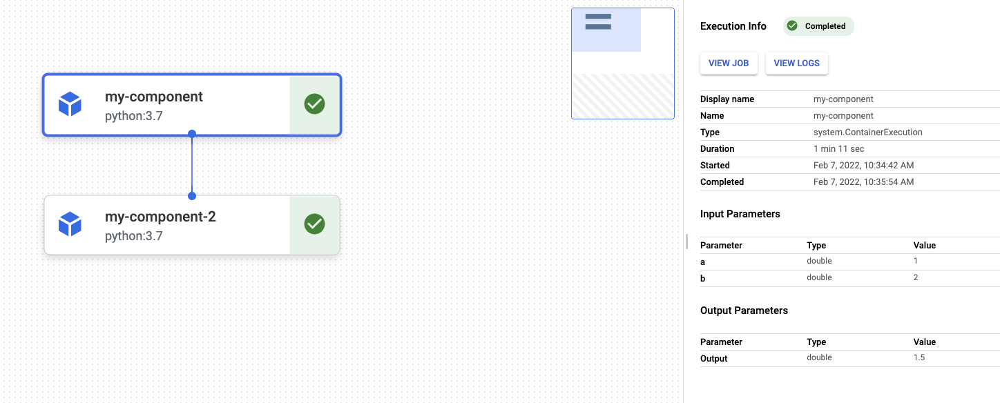

<!-- 
Copyright 2022 Google LLC

Licensed under the Apache License, Version 2.0 (the "License");
you may not use this file except in compliance with the License.
You may obtain a copy of the License at

    https://www.apache.org/licenses/LICENSE-2.0

Unless required by applicable law or agreed to in writing, software
distributed under the License is distributed on an "AS IS" BASIS,
WITHOUT WARRANTIES OR CONDITIONS OF ANY KIND, either express or implied.
See the License for the specific language governing permissions and
limitations under the License.
 -->

# KFP Components

Please see components for training pipeline and prediction pipeline [here](../README.md)

## Add a new Python function-based component

To create a new KFP component, you need a python function, which should not have any code declared outside of the function definition. 
In other words, package importing, and variable creation should all be done inside the python function. In addition, a component decorator wraps up the python function into a component (`ContainerOp` object).
You can specify a name, a brief description, base image, packages needed for wrapping up python function and more in the component decorator. 
The following code shows an example of creating a KFP component. In this component, we use `python3.7` as our base image. Since numpy will be used to create an array and calculate the mean value of the array, it should be installed to the base image and imported inside the python function.

```python
from kfp.v2.dsl import component

@component(
  packages_to_install=[`numpy`],
  base_image='python:3.7',
)
"""
  Example of building a  Python function-based component
"""
def my_component(a: float, b: float) -> float:
    import numpy as np

    my_array = np.array([a,b])
    return np.mean(my_array)
```

Here are some references that could help you to gain a deeper understanding of Kubeflow components so that you can design a more complicated component.
- [KFP Component Introduction](https://www.kubeflow.org/docs/components/pipelines/sdk-v2/python-function-components/#packages)
- [KFP Component Decorator](https://github.com/kubeflow/pipelines/blob/master/sdk/python/kfp/v2/components/component_decorator.py)

### Component I/O
Since a pipeline always includes multiple components, it is essential to understand how data is passed across different components.

There are two categories of a component's inputs and outputs, parameters and artifacts.
Parameters represent values. They are inputs or outputs of type `str`, `int`, `float`, `bool`, `dict`, or `list` that typically are used to change the behavior of a pipeline. 
Artifacts represent references to objects – most commonly files – that are produced during pipeline executions. They are `Artifact`, `Dataset`, `Metrics`, `Model`,
`HTML`, `Markdown`, `ClassificationMetrics`, `SlicedClassificationMetrics`. Regardless of the types of artifacts, all artifacts have a name, a Uniform Resource Identifier (normally it will be a GCS URI related to your staging folder), and optionally some metadata. 
To use these artifacts as an input or output, you should pass them to a KFP `Input` or `Output` class after importing them from [Kubeflow domain specific language package](https://kubeflow-pipelines.readthedocs.io/en/latest/source/kfp.dsl.html).
Here is a detailed example: [Building a complicated KFP component](https://www.kubeflow.org/docs/components/pipelines/sdk-v2/python-function-components/)

To call the output of a component in the pipeline, you could apply “.output” method (equivalent to“.output[“Output”]” to components with single output or “.output[“variable_name”]” to components with multiple outcomes. The `variable_name` must be the same as the output artifact at the component function definition, or the fieldnames in NamedTuple Object.
The component example above returns only one float result and the following pipeline firstly calculates the mean of the inputs and calculate the mean of the previous results.

```python
from kfp.v2.dsl import component
import my_component
@dsl.pipeline(pipeline_root='...',
                  name='my-pipeline')
def dummy_dummy(input1:float,input2:float):
    output_one = my_component(a=input1,b=input2)
    my_component(a=output_one.output, b=output_one.outputs['Output'])
```



It is noticeable that the output of a component is a Kubeflow component `TaskOutputArgument` object, so you could not do any operation on it rather than passing it to another component. 
For example, if your component function returns a numerical value, you can not add it with another number (`output_one + 1`)in the pipeline. 

Sometimes you might need to use custom components alongside with prebuilt components. [KFP Prebuilt components](https://google-cloud-pipeline-components.readthedocs.io/en/google-cloud-pipeline-components-0.2.1/google_cloud_pipeline_components.aiplatform.html#google_cloud_pipeline_components.aiplatform.ModelBatchPredictOp)
In that case, it is essential to design your component outputs more carefully. For example, in the [TensorFlow prediction pipeline](../tensorflow/prediction/pipeline.py), a prebuilt component, `ModelBatchPredictOp`, is used for batch prediction.
It takes a list of Google Cloud Storage URIs referring to the upcoming data for prediction and the directory of dataset. You can directly hard-code these URIs and directory in you pipeline. A more practical way is to design a component that returns this information because it changes once you rerun a pipeline without caches. 
Following pipeline best practice, a custom component, [extract_bq_to_dataset](./bigquery/extract_dataset.py) is designed. 

```python
@component(base_image=PYTHON37, packages_to_install=[GOOGLE_CLOUD_BIGQUERY])
def extract_bq_to_dataset(
    project_id: str,
    dataset_id: str,
    table_name: str,
    dataset: Output[Dataset],
    dataset_location: str = "EU",
    extract_job_config: dict = None,
    file_pattern: str = None,
) -> NamedTuple("Outputs", [("dataset_gcs_prefix", str), ("dataset_gcs_uri", list)]):
.....
```
It extracts BQ table to GCS and returns three outputs, a dataset artifact, its GCS URI in list format and an output dataset directory. 
It seems that the dataset artifact and the GCS URI in list is duplicated, because the dataset artifact has an attribute, URI, which is the same as the dataset URI. But, the pre-built component only takes a list of URIs rather than artifact as an input while another component [`generate_statistics`](./tfdv/generate_statistics.py) takes a dataset artifact as an input.
Thus, it is necessary to have these three outputs when designing. To calling individual result in the pipeline, you can use the method mentioned above. For example, if you want to get the list of URIS,
you can apply '.outputs['dataset_gcs_uri']' on this component.

### Component validation
Once you have built new components and included them in a pipeline, you should add expected tasks and corresponding outputs to e2e test scripts in tests/e2e/<tensorflow|xgboost>. 
Then, you can run the following end-to-end (E2E) pipeline tests to validate if the components works properly in the pipeline.
```
make e2e-tests pipeline=<training|prediction>
```

## Customising the base image used in your components

You can easily change the base image used in your custom Python components - see the [KFP docs](https://www.kubeflow.org/docs/components/pipelines/sdk/v2/python-function-components/#selecting-or-building-a-container-image) for more information. You can do this on an individual component basis (using the `base_image` argument in the `@component` decorator).

However you may like to update all (or many) of the base images with the same image, for example if you want to mirror the images in your own container registry e.g. if using a VPC-SC environment. All the custom components use the `python:3.7` image (as is the KFP default) - we have specified this in [`dependencies.py`](dependencies.py) and then imported this value into each custom component decorator. If you want to update all your components to use a mirrored version of `python:3.7`, you can simply update the value in [`dependencies.py`](dependencies.py). Alternatively, if you have more images you would like to use, you can define more images in the [`dependencies.py`](dependencies.py) file and import them to be used in the component definitions in the same way.
